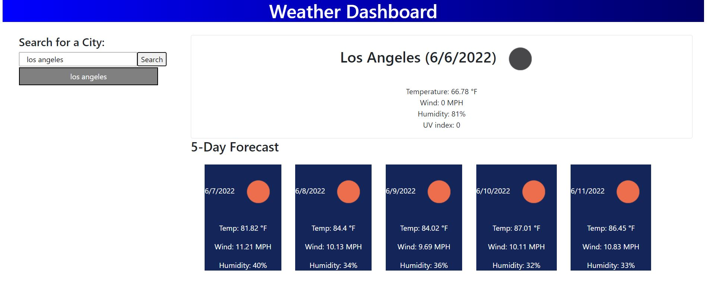

# Weather Dashboard - Overview

This weather dashboard will provide the most current weather for the user. The dashboard retrieves data from the [OpenWeather API](https://openweathermap.org/api). 

The user inputs the city, the dashboard gathers the current temperature, wind speed, humidity and UV index for that city as well as providing a 5 day forecast. An icon image is also provided for a visual representation of the current weather. 

# Screenshot of website

# Links

[URL of GitHub Repository](https://github.com/ehliao/weather-dashboard)

[URL of deployed application](https://ehliao.github.io/weather-dashboard/)